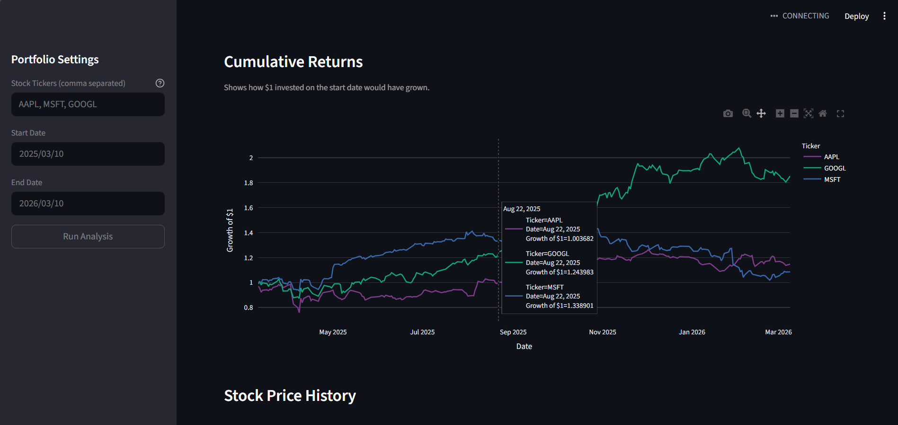

# Portfolio Analytics Dashboard

A personal finance dashboard that pulls real stock market data and breaks down portfolio performance and risk. Built with Python, Streamlit, and Plotly.


---

## What it does

Enter any stock tickers and a date range and the dashboard gives you:

- **Cumulative Returns** - how $1 invested at the start would have grown over time
- **Stock Price History** - price comparison across all your selected stocks
- **Sharpe Ratio** - how much return you're getting for the risk you're taking
- **Max Drawdown** - the worst loss you would have experienced from peak to bottom
- **Portfolio Allocation** - equal-weight split across your selected stocks

---

## Example (Mar 2025 to Mar 2026)

I ran it on Apple, Microsoft, and Google over the past year and got this:

| Ticker | Sharpe Ratio | Max Drawdown |
|--------|-------------|--------------|
| AAPL   | 0.43        | -22.99%      |
| MSFT   | 0.25        | -28.78%      |
| GOOGL  | 2.02        | -15.16%      |

Google had a Sharpe Ratio of 2.02 which is exceptional by any standard. Microsoft on the other hand had the worst drawdown of the three at nearly 29%, meaning anyone holding it through 2025 had a rough ride.

---

## Tech Stack

- Python
- yfinance (market data)
- pandas (calculations)
- Plotly (charts)
- Streamlit (web app)
- Docker (deployment)

---

## Run it locally

```bash
git clone https://github.com/Chubi1407/finance-dashboard.git
cd finance-dashboard
python -m venv venv
venv\Scripts\activate
pip install -r requirements.txt
streamlit run app.py
```

Opens at http://localhost:8501

---

## Run with Docker

```bash
docker build -t finance-dashboard .
docker run -p 8501:8501 finance-dashboard
```

---

## What the metrics mean

**Sharpe Ratio** - measures return per unit of risk. Below 1.0 is poor, 1.0 to 2.0 is good, above 2.0 is exceptional.

**Max Drawdown** - the biggest drop from peak to bottom over your selected period. Risk managers use this to understand worst-case scenarios.

---

## What I would build next

- Portfolio-level Sharpe Ratio across all holdings
- S&P 500 benchmark comparison
- Custom portfolio weights instead of equal split
- Monte Carlo simulation for future projections

---

Chibuikem Emeka-Nwuba - CS Student at University of Saskatchewan  
[LinkedIn](https://linkedin.com/in/chibuikemnwuba) · [GitHub](https://github.com/Chubi1407)